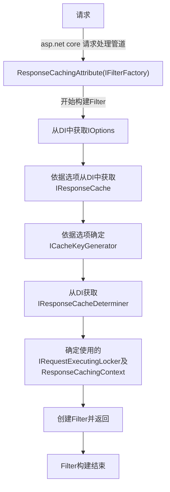
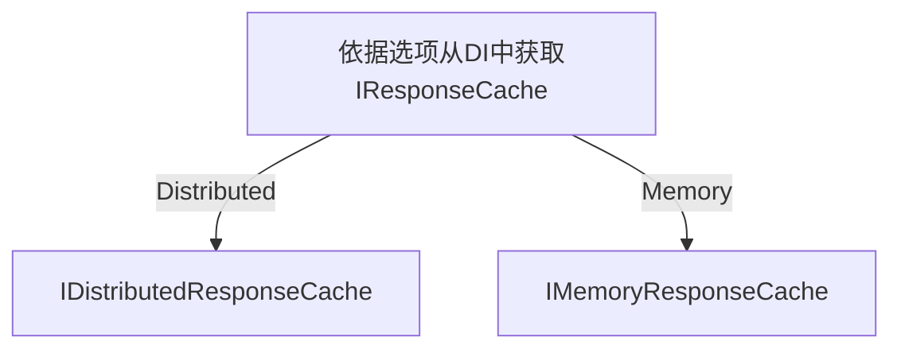
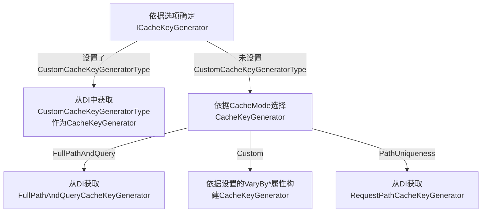
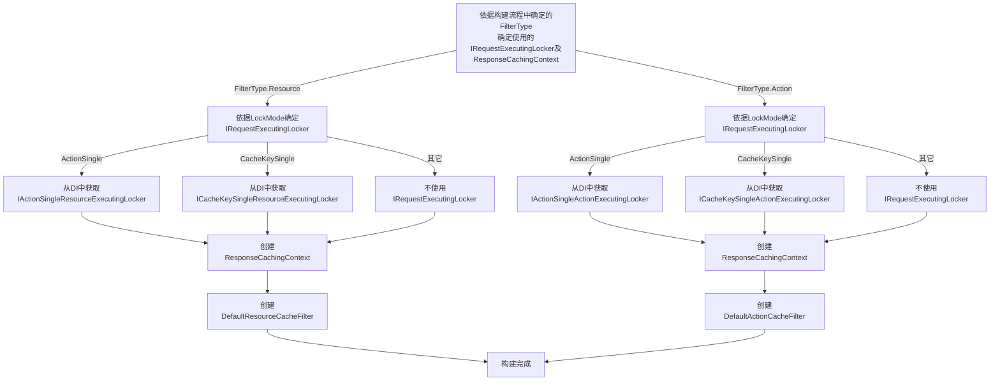
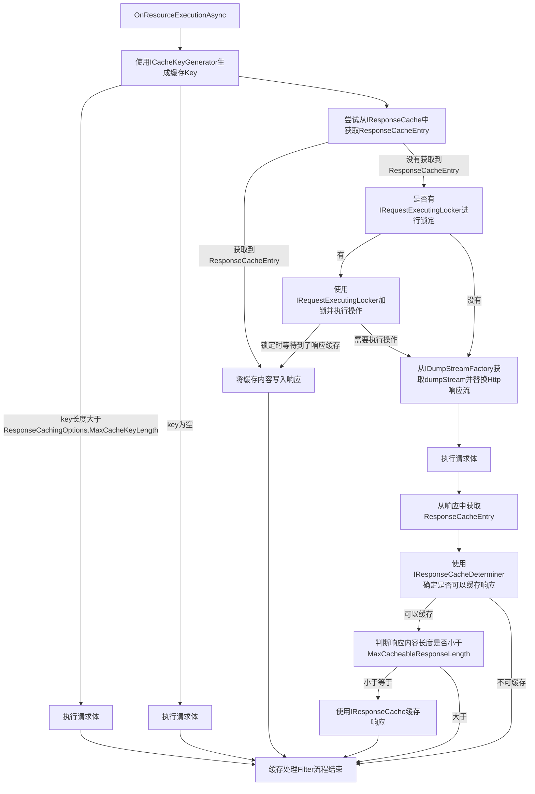
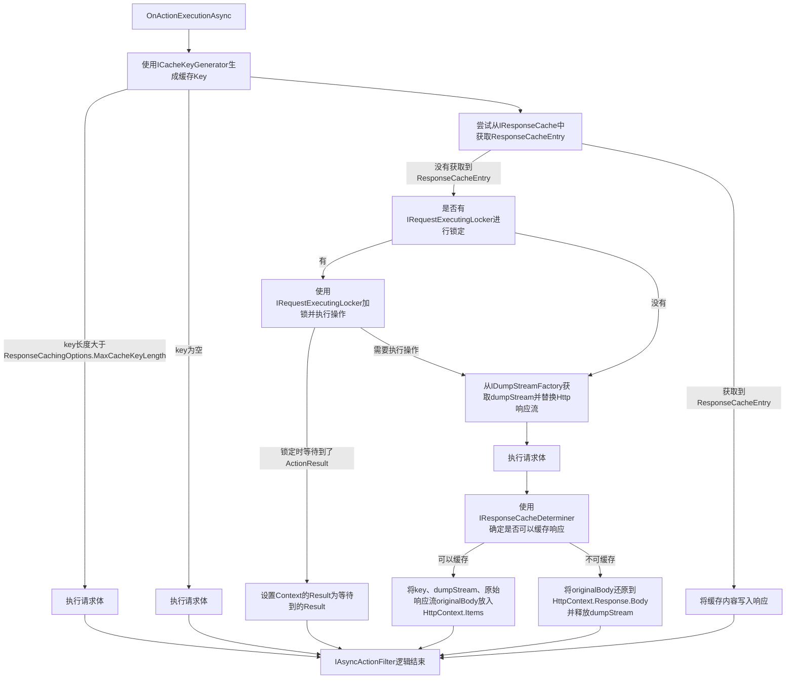
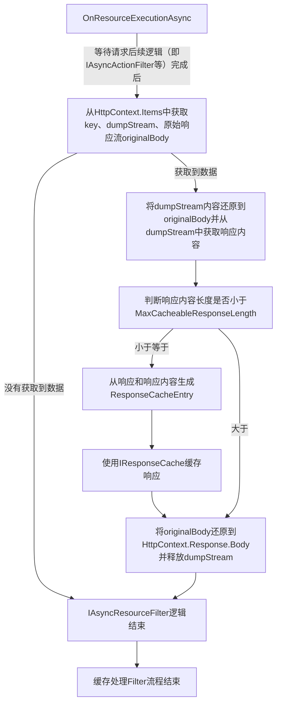

# 部分执行流程

使用支持mermaid的Markdown编辑器查看

-----

## 1. Filter构建流程

----

### 1.1. IResponseCache选择流程

----

### 1.2. ICacheKeyGenerator选择流程

----

### 1.3. IRequestExecutingLocker及ResponseCachingContext选择流程

## 2. Filter执行过程

### 2.1 ResourceFilter执行过程

### 2.2 ActionFilter执行过程
!!!Note:
- ActionFilter为IAsyncActionFilter和IAsyncResourceFilter的结合体，即ActionFilter既实现了IAsyncActionFilter也实现了IAsyncResourceFilter
- 处理流程为IAsyncActionFilter先执行完流程，IAsyncResourceFilter再处理响应的缓存

#### 2.2.1 IAsyncActionFilter执行过程

#### 2.2.2 IAsyncResourceFilter执行过程

